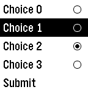
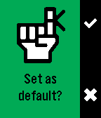
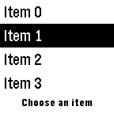
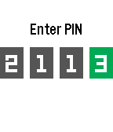

# ui-patterns

Example project showing implementations of recommended Pebble UI design
patterns. Run the app, then choose a menu option to see one of:

## Checkbox list

## Radio Button list

## Message dialog

## Choice dialog

## List hint message

## PIN entry

## Text Animation

## Progress Bar

## Progress Layer

